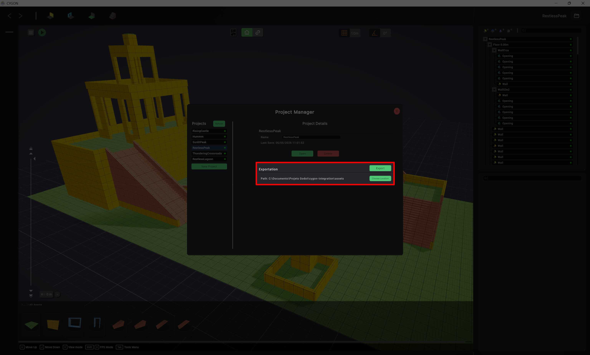
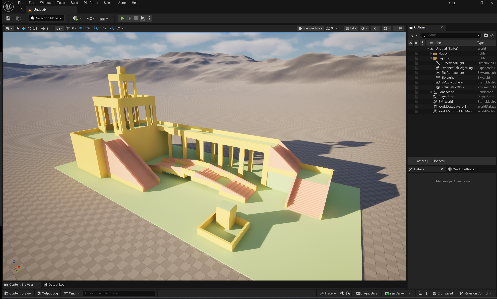

# Your First Import
This guide walks you through importing a scene made in Cygon into Unreal Engine for the first time.

## Step 1 — Export from Cygon
- In Cygon, in the project manager choose the export path location to be in the `Content/` folder of your Unreal Engine project,
- On Cygon use **CTRL + S** or the export button in the Project Manager.
- Cygon will generate a `.usda` file along with a `meshes/` subfolder containing individual mesh files at the location you specified.


**Example output structure inside your UE Content folder were MyScene is the name of your scene in Cygon:**
```
Content/
└── MyScene
    ├── MyScene.usda
    ├── meshes/
    │      ├── Wall.usda
    │      ├── Stairs.usda
    │      └── Floor.usda
    └── MyScene
        ├── Materials/
        │      ├── Wall_Mat.uasset
        │      ├── Stairs_Mat.uasset
        │      └── Floor_Mat.uasset
        └── StaticMeshes/
            └── SM_World.uasset
```

> Exporting directly into the `Content/` folder is required. The plugin resolves asset paths relative to this location.

## Step 1 bis — Alternative: Drag & Drop from File Explorer
If you just want to import a single `.usda` file without setting up the full Cygon export pipeline, you can drag it directly from your OS file explorer into the Unreal Engine Content Browser.
Cygon Link will intercept the file, process it through the USD pipeline, and generate all the native UE assets (Static Meshes, Materials, etc.) just like a normal import.

> **Important limitation:** This method does **not** support hot reload (or Live Sync). If you later modify the scene in Cygon and re-export, Unreal Engine will not automatically detect and reimport the changes. For live sync to work, the file must be exported directly into the `Content/` folder as described in Step 1.

## Step 2 — Import into Unreal Engine
- Switch to Unreal Engine. The Content Browser should detect the new files automatically. You may have to approve the import process in the Editor with with a pop-up.
- Cygon Link will intercept the import and process it through the USD pipeline.
- Native UE assets (Static Meshes, Materials, etc.) will be generated automatically in the same folder.

## Step 3 — Add to Level
Drag the imported asset from the Content Browser into your **Level Viewport** or **Outliner**, and now you can use what you've just created in Cygon.

## Testing Without Cygon
Sample files are included at [Docs/Samples](Samples).

You can drag it directly into the Content Browser to verify that (following the steps above starting from Step 1 bis):
- Cygon Link correctly intercepts the file.
- The USD Importer processes it and generates assets.
- No errors appear in the Output Log.

It should look like this in you viewport after importing and dragging it into the level:

